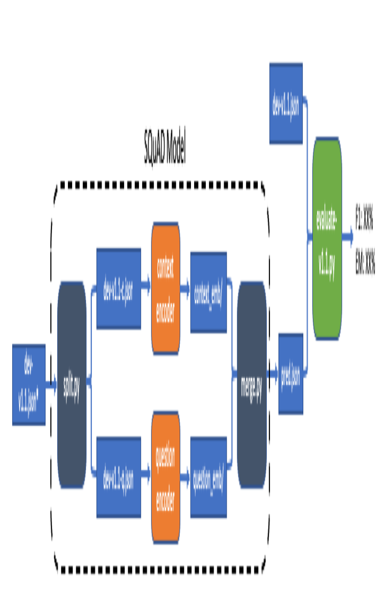

# Phrase-Indexed SQuAD (PI-SQuAD)

## Baseline Models

### 0. Download requirements
Make sure you have Python 3.6 or later. Download and install all requirements by:

```bash
chmod +x download.sh; ./download.sh
```

This will install following python packages:

- `numpy==1.15.2`, `scipy==1.1.0`, `torch==0.4.1`, `nltk==3.3`: essential packages
- `allenlp==0.6.1`: only if you want to try using [ELMo][elmo]; the installation takes some time.
- `tqdm`: optional, progressbar tool.
- `gensim`: optional, running tf-idf experiments in `scripts`.

This will also download several things at `$HOME/data` (consider changing it to your favorite location):

- nltk word tokenizer
- GloVe 6B
- ELMo options and weights files

You might also want to consider using docker image `minjoon/research:180908` that meets all of these requirements.
The [sample CodaLab submission][worksheet-elmo] also uses this. 

Download the original SQuAD v1.1 train and dev set at [`$SQUAD_TRAIN_PATH`][squad-train] and [`$SQUAD_DEV_PATH`][squad-dev], respectively. The default directory that our baseline model searches in is `$HOME/data/squad`.

#### Demo
In order to run demo, you will also need:

- `faiss`, `pysparnn`: similarity search packages for dense and sparse vectors respectively.
- `tornado`, `flask`: to serve the demo on the web.

The easiest way to install `faiss` is via `conda`: `conda install faiss -c pytorch`. So you might want to consider using `conda` before installing the requirements above.


### 1. Training
In our [paper][paper], we have introduced three baseline models:

For LSTM model:

```bash
python main.py baseline --cuda --train_path $SQUAD_TRAIN_PATH --test_path $SQUAD_DEV_PATH
```

For LSTM+SA model:

```bash
python main.py baseline --cuda --num_heads 2 --train_path $SQUAD_TRAIN_PATH --test_path $SQUAD_DEV_PATH
```

For LSTM+SA+ELMo model:

```bash
python main.py baseline --cuda --num_heads 2 --elmo --train_path --batch_size 32 $SQUAD_TRAIN_PATH --test_path $SQUAD_DEV_PATH
```

Note that the first positional argument, `baseline`, indicates that we are using the python modules in `./baseline/` directory.
In future, you can easily add a new model by creating a new module (e.g. `./my_model/`) and giving the positional argument (`my_model`).

By default, these commands will output all interesting files (save, report, etc.) to `/tmp/piqa/squad`. You can change the directory with `--output_dir` argument. Let `$OUTPUT_DIR` denotes this.


### 2. Easy Evaluation
Assuming you trust us, let's just try to output the prediction file from a full (context+question) dataset, and evaluate it with SQuAD v1.1 evaluator. To do this with LSTM model, simply run:

```bash
python main.py baseline --cuda --mode test --load_dir $OUTPUT_DIR/save/####/model.pt --test_path $SQUAD_DEV_PATH
```

Where the #### indicates the step at which the model of interest is saved (e.g. `7001`). Take a look at the standard output during training and pick the one that gives the best performance (which is automatically tracked). Technically speaking, this is *cheating* on the dev set, but we are going to evalute on the test set at the end, so we are okay.

This will output the prediction file at `$OUTPUT_DIR/pred.json`. Finally, simply feed it to the SQuAD v1.1 evaluator (changed name from `evaluate-v1.1.py` to `evaluate.py`):

```bash
python evaluate.py $SQUAD_DEV_PATH $OUTPUT_DIR/pred.json
```

That was easy! But why is this not an *official evaluation*? Because we had a big assumption in the beginning, that you trust us that our encoders are independent. But who knows?


### 3. Official Evaluation

#### How?

We need a strict evaluation method that enforces the independence between the encoders. We require 'split-encode-merge' pipeline to ensure this:



where 'dev1.1.json*' does not contain the answers. A regular SQuAD v1.1 submission will correspond to uploading a model that replaces the black dotted box. A PI-SQuAD submission instead requires one to upload two encoders, document encoder and question encoder, that the replace orange boxes. They **must** be preceded by `split.py` and followed by `merge.py`. We describe the expected formats of `dev-v1.1-c.json`, `dev-v1.1-q.json`, `context_emb/` and `question_emb/`.

`dev-v1.1-c.json` and `dev-v1.1-q.json`: `split.py` simply splts `dev-v1.1.json` into context-only and question-only json files.


`context_emb/`: the directory should contain a numpy file (`.npz`) and a list of phrases (`.json`) for each context (paragraph).

`question_emb/`: the directory should contain a numpy file for each question.

The directories will look as following:

```
$OUTPUT_DIR
+-- context_emb/
|   +-- Super_Bowl_50_0.npz
|   +-- Super_Bowl_50_0.json
|   +-- Super_Bowl_50_1.npz
|   +-- Super_Bowl_50_2.json
|   ...
+-- question_emb/
|   +-- 56be4eafacb8001400a50302.npz
|   +-- 56d204ade7d4791d00902603.npz
|   ...
```

This looks quite complicated! Let's take a look at one by one.

1. **`.npz` is a numpy/scipy matrix dump**: Each `.npz` file corresponds to a *N-by-d* matrix. If it is a dense matrix, it needs to be saved via `numpy.savez()` method, and if it is a sparse matrix (depending on your need), it needs to be saved via `scipy.sparse.save_npz()` method. Note that `scipy.sparse.save_npz()` is relatively new and old scipy versions do not support it.
2. **each `.npz` in `context_emb` is named after paragraph id**: Here, paragraph id is `'%s_%d' % (article_title, para_idx)`, where `para_idx` indicates the index of the paragraph within the article (starts at `0`). For instance, if the article `Super_Bowl_50` has 35 paragraphs, then it will have `.npz` files until `Super_Bowl_50_34.npz`. 
3. **each `.npz` in `context_emb` is *N* phrase vectors of *d*-dim**: It is up to the submitted model to decide *N* and *d*. For instance, if the paragraph length is 100 words and we enumerate all possible phrases with length <= 7, then we will approximately have *N* = 700. While we will limit the size of `.npz` per word during the submission so one cannot have a very large dense matrix, we will allow sparse matrices, so *d* can be very large in some cases.
4. **`.json` is a list of *N* phrases**: each phrase corresponds to each phrase vector in its corresponding `.npz` file. Of course, one can have duplicate phrases (i.e. several vectors per phrase).
5. **each `.npz` in `question_emb` is named after question id**: Here, question id is the official id in original SQuAD 1.1.
6. **each `.npz` in `question_emb` must be *1*-by-*d* matrix**: Since each question has a single embedding, *N* = 1. Hence the matrix corresponds to the question representation.

Following these rules, one should confirm that `context_emb` contains 4134 files (2067 `.npz` files and 2067 `.json` files, i.e. 2067 paragraphs) and `question_emb` contains 10570 files (one file for each question) for SQuAD v1.1 dev dataset. Hint: `ls context_emb/ | wc -l` gives you the count in the `context_emb` folder. 

#### Running baseline

To split `dev-v1.1.json`:
```
python split.py $SQUAD_DEV_PATH $SQUAD_DEV_CONTEXT_PATH
```

Now, for document and question encoders, we run `main.py` with two different arguments for each.

For document encoder:

```bash
python main.py baseline --cuda --mode embed_context --load_dir $OUTPUT_DIR/save/XXXX/model.pt --test_path $SQUAD_DEV_CONTEXT_PATH --context_emb_dir $CONTEXT_EMB_DIR
```

For question encoder:

```bash
python main.py baseline --cuda --mode embed_question --load_dir $OUTPUT_DIR/save/XXXX/model.pt --test_path $SQUAD_DEV_QUESTION_PATH --question_emb_dir $QUESTION_EMB_DIR
```

The encoders will output the embeddings to `$CONTEXT_EMB_DIR` and `$QUESTION_EMB_DIR`, respectively. Using compressed dump for the LSTM model, these directories take about 500 MB of disk space.

To merge:

```bash
python merge.py $SQUAD_DEV_PATH $CONTEXT_EMB_DIR $QUESTION_EMB_DIR $PRED_PATH
```

where `$PRED_PATH` is the prediction path.
For our baselines, this takes ~4 minutes on a typical consumer-grade CPU, though keep in mind that the duration will depend on the size of *N* and *d*.
By default the evaluator assumes the dumped matrices are dense matrices, but you can also work with sparse matrices by giving `--sparse` argument.
If you have `tqdm`, you can display progress with `--progress` argument. 
The evaluator does not require `torch` and `nltk`, but it needs `numpy` and `scipy`.

Note that we currently only support *inner product* for the nearest neighbor search (our baseline model uses inner product as well). We will support L1/L2 distances when the submission opens. Please let us know (create an issue) if you think other measures should be also supported. Note that, however, we try to limit to those that are commonly used for approximate search (so it is unlikely that we will support a multilayer perceptron, because it simply does not scale up).

Lastly, to evaluate, use the official evalutor script:

```
python evaluate.py $SQUAD_DEV_PATH $PRED_PATH
```

### 3. Demo
Demo uses dumped context embeddings. We need to make on change: when encoding document (context), give `--metadata` flag to output additional necessary data for demo:
```bash
python main.py baseline --cuda --mode embed_context --load_dir $OUTPUT_DIR/save/XXXX/model.pt --test_path $SQUAD_DEV_CONTEXT_PATH --context_emb_dir $CONTEXT_EMB_DIR
```

Then run the demo by:
```bash
python main.py baseline --mode serve_demo --load_dir $OUTPUT_DIR/save/XXXX/model.pt --context_emb_dir $CONTEXT_EMB_DIR --port 8080
```

This will serve the demo on localhost at port 8080. Enjoy!


## Submission
Please see the [sample submission worksheet][worksheet-elmo] for instructions on how to submit a PI-SQuAD model for test set. In short, it should be a valid SQuAD submission, but in addition, it should meet the requirements described above. Please email `minjoon@cs.washington.edu` for the submission with both a link to the worksheet and a link to the prediction bundle. Whether it abides split-encode-merge pipeline will be first checked, and then will be forwarded to SQuAD v1.1 submission.


[paper]: https://arxiv.org/abs/1804.07726
[minjoon]: https://seominjoon.github.io
[minjoon-github]: https://github.com/seominjoon
[squad-train]: https://rajpurkar.github.io/SQuAD-explorer/dataset/train-v1.1.json
[squad-dev]: https://rajpurkar.github.io/SQuAD-explorer/dataset/dev-v1.1.json
[squad-context]: https://uwnlp.github.io/piqa/data/squad/dev-v1.1-context.json
[squad-question]: https://uwnlp.github.io/piqa/data/squad/dev-v1.1-question.json
[elmo]: https://allennlp.org/elmo
[squad]: https://stanford-qa.com
[mipsqa]: https://github.com/google/mipsqa
[worksheet-elmo]: https://worksheets.codalab.org/worksheets/0x58f20753fb784ffaa37877f777057b17/
